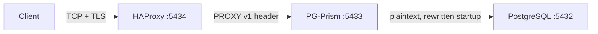

# PG-Prism 💎

**A per-host sidecar proxy that restores the client address PostgreSQL loses behind a TCP load balancer.**


> ### ⚠️ Not production ready
>
> This is a conference project. It has a test suite and CI against PostgreSQL 16
> and 18, but it has never run a production workload, it has not been reviewed by
> anyone but its author, and [`AUDIT.md`](AUDIT.md) documents defects that are
> still open. Read [Known limitations](#known-limitations) before you deploy it
> anywhere that matters — several of them are architectural, not bugs awaiting a
> fix.

## The problem

HAProxy already knows the real client address and can send it, with `send-proxy`.
PostgreSQL cannot read it: the backend sees a startup packet prefixed by a line it
does not understand, and closes the connection. So behind an L4 load balancer,
`pg_stat_activity.client_addr` and `log_line_prefix`'s `%h` both show the load
balancer, and "who is running this query right now" has no answer.

The correct fix is [Magnus Hagander's PROXY protocol patch for
core](https://commitfest.postgresql.org/36/3032/), which puts the real address in
`client_addr` where it belongs. It has been in review since 2021. PG-Prism is a
stop-gap for the versions shipping today: something that consumes the PROXY
header before PostgreSQL sees it, and puts the address somewhere you can read it.

When the core patch lands, delete this.

## What it actually does

Clients connect to HAProxy (`mode tcp`). HAProxy forwards to PG-Prism on the
database host with `send-proxy`, prefixing a PROXY protocol **v1** header.
PG-Prism reads the header, extracts the original client address, and opens a
**plaintext** connection to PostgreSQL.



To the connection, it:

- Answers `SSLRequest` itself and **terminates TLS with its own certificate**
  (self-signed by default). Answers `GSSENCRequest` with `N`.
- Parses the StartupMessage and rewrites `application_name` to
  `"<original> - <client ip>"`, adding the parameter if it is absent.
- Relays every authentication message verbatim, so `scram-sha-256` works
  unchanged.
- Relays `CancelRequest` unmodified on its own connection.
- Forwards everything else byte for byte. It does not parse SQL.

The address ends up here:

```
$ scripts/smoke-native.sh
==> pg_stat_activity row
  smoke-test - 127.0.0.1|127.0.0.1
```

That is real output from `scripts/smoke-native.sh`, and it is deliberately
unflattering: both columns say `127.0.0.1` because everything is on one host. The
first is the address PG-Prism recovered from the PROXY header; the second is
`client_addr`, which is still the proxy and which PG-Prism **cannot** change —
only the core patch can. To see the two columns disagree you need a client on
another interface.

The address is a string in `application_name`. Everything in
[Known limitations](#known-limitations) follows from that.

## Guardian

An optional rule engine (`guardian.yaml`, first match wins) evaluated at
connection time against client IP, user, database and time of day, yielding
`ALLOW`, `INSPECT` or `DENY`. Under `INSPECT`, `Query` and `Parse` messages
**smaller than 1 KB** are token-matched against blocked commands and table names;
a match is answered with a synthetic `ErrorResponse`.

**Guardian is a guard rail, not a security control.** It exists to catch a
mistake, not to stop an adversary, and it is trivially bypassed. The bypasses are
documented below and in `core/rust/guardian.yaml` itself. If you need
authorisation, use PostgreSQL's — roles, `GRANT`, and row-level security are
enforced by the server, which is the only thing in this picture that actually
knows what a table is.

A missing `guardian.yaml` means no rules. A malformed one is a **startup
failure**, deliberately: a firewall that disables itself on a typo is worse than
no firewall, because you believe it is running.

## Known limitations

These are the things a reviewer will find. They are here so you find them first.

### TLS terminates at the proxy

PG-Prism presents **its own certificate**, not PostgreSQL's, and speaks plaintext
on the backend leg. Consequences:

- **`sslmode=verify-full` and `verify-ca` do not work through it** unless you
  supply a certificate that matches the name your clients connect to. The default
  is self-signed, so clients must use `sslmode=require` or weaker — which
  authenticates nothing.
- **`scram-sha-256-plus` is not available.** Channel binding ties authentication
  to the TLS session, and there are two different TLS sessions here (one, if the
  backend leg is plaintext). Plain `scram-sha-256` works.
- **The backend leg must not cross a network boundary.** It carries credentials
  and query results in clear. Loopback or pod-local only. Nothing in the code
  enforces this.

### `application_name` is not an audit control

It remains client-writable. Any client can issue `SET application_name = 'anything'`
after connecting, or `RESET application_name`, and the injected address is gone.
PG-Prism does not intercept those statements — an earlier version tried to, and
corrupted legitimate SQL that merely mentioned `application_name`
(`AUDIT.md` finding #3).

Treat it as an **observability aid**: it tells you where a well-behaved client
came from. It does not tell you where a determined one came from, and it must not
appear in a compliance document.

### Guardian does not inspect most traffic

- **Anything 1 KB or larger is forwarded uninspected.** Padding a statement with
  1023 bytes of comment bypasses every rule. This is a deliberate performance
  trade-off and a complete bypass; both are true.
- It searches the raw statement text and does not parse SQL, so a blocked keyword
  inside a comment or a string literal still matches and blocks a harmless query.
- Case folding is **ASCII only**. A rule for `müşteri` will not match `MÜŞTERI`.
- Double-quoted identifiers are case-sensitive in PostgreSQL, so `"SECRETS"` is a
  different table from `secrets` — Guardian blocks it anyway.
- Rules match statement text, so a view, a function body, or a prepared statement
  bound later reaches the table without matching anything.

### Open defects

[`AUDIT.md`](AUDIT.md) is the full list with evidence. The ones most likely to
surprise you:

| | |
|---|---|
| A misspelled field in a Guardian rule is **silently ignored**; the rule loads, is counted in the startup log, and blocks nothing (#53) | unfixed |
| One unparseable CIDR in a rule's `ips` list is silently skipped, so a `DENY` stops applying to those addresses (#54) | unfixed |
| A malformed `time_range` makes a `DENY` rule never match, at any hour (#55) | unfixed |
| `SSL_ENABLED` accepts only the spelling `true`; `1`, `yes`, `on` all silently disable TLS (#56) | unfixed |
| TLS that fails to initialise under `SSL_ENABLED=true` logs the error and serves **plaintext anyway** (#57) | unfixed |
| No `SIGTERM` handling or graceful drain: a restart drops every established connection (#42) | unfixed |

### Not implemented

PROXY protocol **v2** — use `send-proxy`, not `send-proxy-v2`; a v2 header is
refused rather than misparsed, but it is refused. Also: connection pooling, load
balancing, failover, and PostgreSQL protocol 2.0 (refused with SQLSTATE `08P01`).

IPv6 clients *are* supported — a `PROXY TCP6` header carries the address through
injection intact, including a full-length 39-character literal.

## Security model

**PG-Prism must only be reachable from the load balancers you operate.**

The PROXY header is an unauthenticated assertion by the peer about who *it* is
talking to. Anyone who can open a TCP connection to the listener can claim any
source address — falsifying `pg_stat_activity` and satisfying Guardian `ips:`
rules at the same time.

`TRUSTED_PROXIES` enforces this and defaults to loopback. It is a security
control, not a convenience setting. The proxy refuses to start if the list is
malformed, and refuses connections from anywhere else without reading a byte.
Setting `TRUSTED_PROXIES=0.0.0.0/0,::/0` disables the protection entirely.

This mirrors the `proxy_servers` GUC in the core patch, deliberately.

## Installation

### Docker

```bash
docker compose up --build
# clients connect to HAProxy on :5434
```

The compose file pins the network subnet so `TRUSTED_PROXIES` can name it;
HAProxy is a separate container there, so it is not on loopback and the default
allowlist would refuse it.

### Native

Needs a Rust toolchain and the `openssl` CLI on `PATH` (the proxy shells out to
it to mint its self-signed certificate).

```bash
cd core/rust
cargo build --release --locked
./target/release/pg-prism-rust
```

`guardian.yaml` is read from the **working directory**, not from a configurable
path. See [`docs/DEV_ENVIRONMENT.md`](docs/DEV_ENVIRONMENT.md) for a full local
setup, including a Docker-free path.

### systemd

```ini
[Unit]
Description=PG-Prism Sidecar Proxy
After=network.target postgresql.service

[Service]
Type=simple
User=postgres
WorkingDirectory=/opt/pg-prism
ExecStart=/opt/pg-prism/pg-prism-rust
Restart=always
RestartSec=5

Environment=LISTEN_HOST=127.0.0.1
Environment=LISTEN_PORT=5433
Environment=PG_HOST=127.0.0.1
Environment=PG_PORT=5432

[Install]
WantedBy=multi-user.target
```

`WorkingDirectory` matters: it is where `guardian.yaml` and the generated
certificate files are looked for. On SELinux systems run
`sudo restorecon -Rv /opt/pg-prism`.

## Configuration

| Variable | Default | Description |
| :--- | :--- | :--- |
| `LISTEN_HOST` | `0.0.0.0` | Binding address. Prefer `127.0.0.1` for a sidecar. |
| `LISTEN_PORT` | `5433` | Port to listen on |
| `PG_HOST` | `localhost` | Target PostgreSQL host |
| `PG_PORT` | `5432` | Target PostgreSQL port |
| `TRUSTED_PROXIES` | `127.0.0.0/8,::1/128` | Comma-separated CIDRs or bare addresses allowed to send a PROXY header. Malformed entries are a startup failure. |
| `SSL_ENABLED` | `true` | TLS termination. **Only the exact string `true` enables it** (finding #56). |
| `HANDSHAKE_TIMEOUT_SECS` | `10` | Covers the PROXY header, SSL negotiation and startup together |
| `UPSTREAM_CONNECT_TIMEOUT_SECS` | `5` | Deadline for reaching PostgreSQL |
| `TCP_KEEPALIVE_SECS` | `60` | Idle time before the kernel probes the peer. Not an idle timeout: an idle-but-alive peer answers and the connection survives. |

Malformed values for the three timeouts are a startup failure rather than a
silent fallback to the default.

## HAProxy

```haproxy
backend postgres_backend
    mode tcp
    # Target 5433, PG-Prism, not 5432
    server pg01 10.0.0.1:5433 check port 8008 send-proxy
```

`check port 8008` probes Patroni's REST API, which reports on **PostgreSQL**, not
on the sidecar. A hung PG-Prism with a healthy PostgreSQL behind it is still
marked UP and still receives traffic (`AUDIT.md` §8.2). PG-Prism exposes no
health endpoint of its own; a TCP check against `:5433` is the minimum
improvement and is still not a liveness check.

## Prior art

| | |
|---|---|
| **PgBouncer `application_name_add_host`** | The closest thing to this. Works only when PgBouncer terminates the client connection — put HAProxy in front and PgBouncer records HAProxy's address. Also overridable by a client `SET`, same as here. |
| **HAProxy `send-proxy`** | Sends the address correctly. PostgreSQL cannot read it. That gap is the whole reason this exists. |
| **[Core PROXY protocol patch](https://commitfest.postgresql.org/36/3032/)** | The right answer. Populates `client_addr`, `pg_hba.conf` matching and `%h` properly. In review since 2021. |
| **`log_line_prefix` `%h`** | Free and correct, for the address PostgreSQL sees — which behind a proxy is the proxy. Log-only. |

## Testing

```bash
cd core/rust
cargo test                                    # hermetic; no server needed
cargo test -- --include-ignored --test-threads=1   # adds the real-PostgreSQL suite
```

The second needs a reachable PostgreSQL and `PGHOST`/`PGUSER`/`PGPASSWORD` set.
CI runs both against PostgreSQL 16 and 18 on every push.

Two suites, deliberately. The fast one drives an in-process fake backend; the
slow one drives a real server through `tokio-postgres`. The split exists because
a backend you wrote yourself agrees with you about what is worth recognising —
two of the more serious findings in `AUDIT.md` were invisible to the fake one and
turned up the moment a real server was at the other end.

## License

MIT — see [LICENSE](LICENSE).
